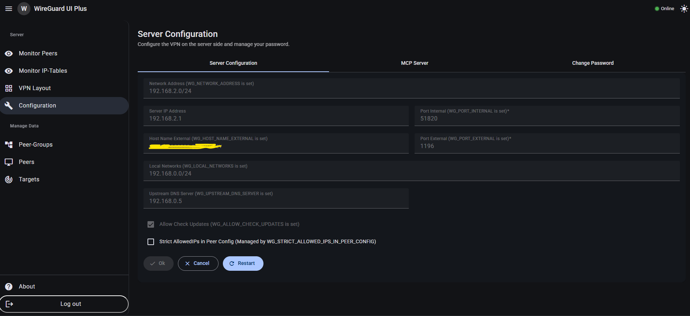
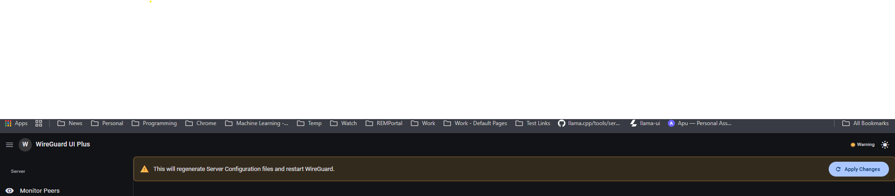
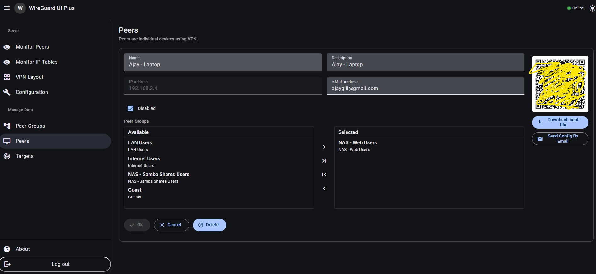
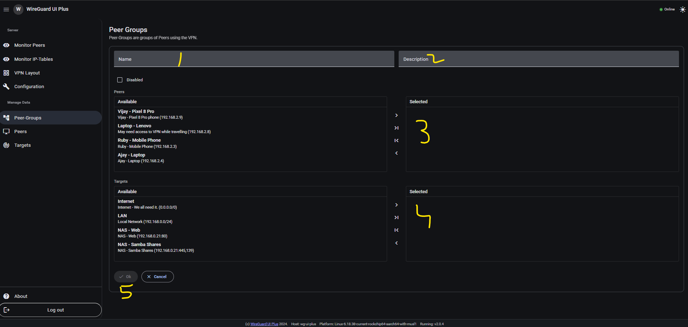
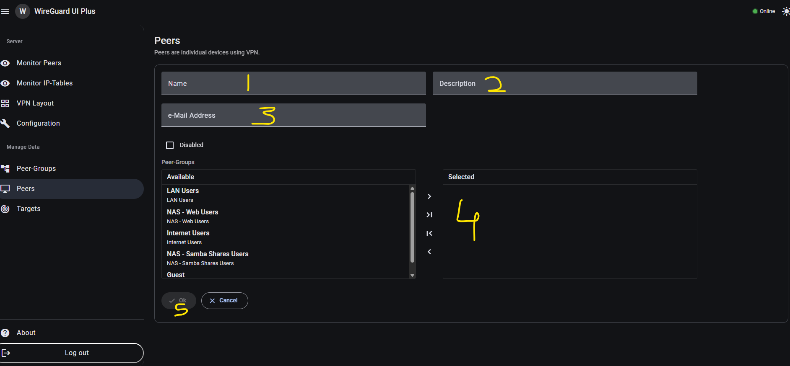
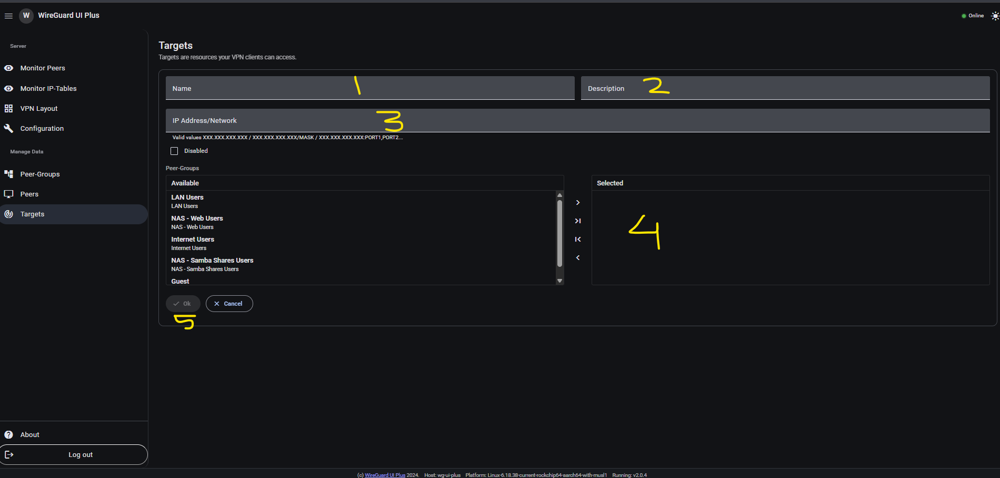
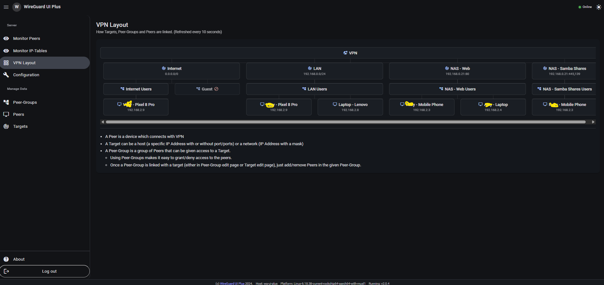
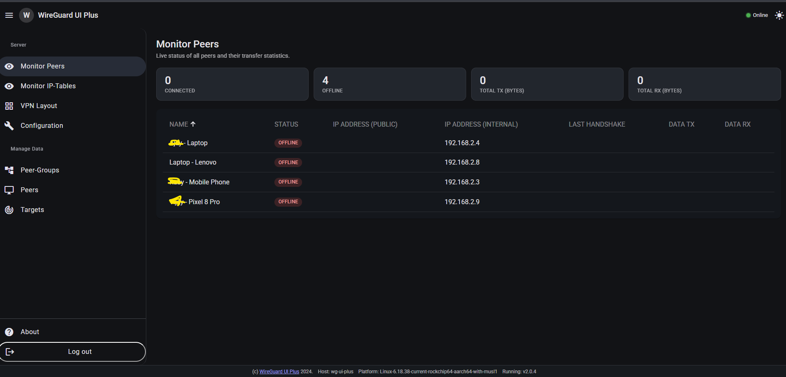
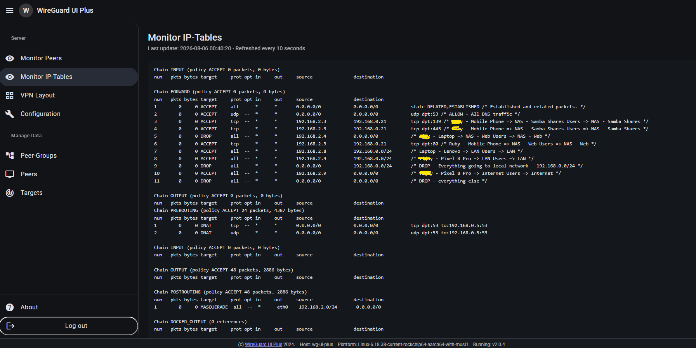

# WireGuard UI Plus

WireGuard UI Plus is a Dockerized web UI for running and managing a WireGuard VPN. The Angular single-page application and the Django REST API run together in the same container.

## Disclaimer

Use this software at your own risk. It was developed for personal use at home and is shared in the hope that it is useful to others.

## Background

I run a WireGuard (TM) VPN at home so that I can access machines and network-connected devices while I am away. I sometimes allow friends to access my machine-learning rig, but I do not want them to have unrestricted access to my home network.

I created this project to avoid managing fine-grained iptables rules by hand in WireGuard `PostUp` scripts.

Issues and pull requests are welcome.

## Features

- Manage clients (peers), including assigning peers to groups.
- Manage targets, which can be hosts, host-and-port combinations, or networks.
- Grant or revoke access by associating peer groups with targets. This supports configurations such as:
  - Internet access through the VPN, without access to other local resources.
  - SSH-only access to a host.
  - Access to Samba shares on a NAS.
  - Access to the Internet and every machine on the LAN.
  - Access only to selected hosts on the LAN.
- Generate and manage WireGuard configuration without manually maintaining iptables rules.
- Access the web UI remotely, ideally through a properly secured reverse proxy and HTTPS.
- Display peer QR codes and allow `.conf` files to be downloaded or shared by email.
- Run on Raspberry Pi and other single-board computers. The project was developed on an Orange Pi 5+.
- Toggle between dark and light themes with a responsive layout for small screens.

### Implemented functionality

- [x] Manage targets: add, edit, and disable targets.
  - [x] Add or remove peer groups from targets to grant or revoke access.
- [x] Manage peers: add, edit, and disable peers.
  - [x] Add or remove peers from peer groups.
- [x] Manage peer groups: add, edit, and disable groups.
  - [x] Add or remove targets from peer groups.
- [x] Live dashboard.
  - [x] Monitor peer status, including the last handshake and transfer statistics.
  - [x] Monitor iptables rules and counters for the relevant chains.
- [x] VPN layout visualization showing relationships between targets, peer groups, and peers.
- [x] Authentication and password changes from the **Change Password** tab on **Server Configuration**.
- [x] Peer configuration tools:
  - [x] Display a QR code for scanning on a client device.
  - [x] Download or share a `.conf` file.
  - [x] Send a peer configuration by email with one click when email is configured.
- [x] Server configuration:
  - [x] Strict `AllowedIPs` mode, which lists only the target IP addresses a peer may access instead of `0.0.0.0/0`.
  - [x] Optional update checks against the GitHub releases page. The footer displays the running version and a link when a newer release is available.
- [x] Back up the SQLite database automatically on every container start.
- [x] Streamable HTTP MCP server support (disabled by default; see [MCP support](#mcp-support)).

## Architecture

- **Frontend:** Angular 22 with a responsive single-page application. Production output is copied to `/app/clientapp` in the live image.
- **Backend:** Django and Django REST Framework, with the SQLite database stored at `/data/wg_ui_plus.db`.
- **Serving:** Django serves the Angular application and static files using `django-spa` and WhiteNoise.
- **WireGuard:** The generated configuration is stored at `/config/wireguard/wg0.conf`.
- **Image:** The multi-stage `Dockerfile` contains development, Angular builder, and production runtime stages. The production image uses an Alpine Python runtime; the development image includes Node.js, Angular CLI, and Python tooling.

## Requirements

You need Docker and permission to run containers on the machine that will host the VPN. The container must be allowed to manage the host's WireGuard networking, so the examples grant `NET_ADMIN` and `SYS_MODULE` and set the required IPv4 sysctls.

## Quick setup

The default username and password are `admin` / `admin`. Change the password immediately after the first login from **Server Configuration** → **Change Password**.

1. Determine:
   - The public IP address or DNS name of your router (the external host name).
   - The private IP address of the machine running WireGuard (the internal host address).
2. Forward a UDP port on your router to UDP port `51820` on the internal host. The command below uses external port `1196`.
3. Create persistent directories owned by the container's runtime user and start the container. The published image creates its application user with UID and GID `1000`:

   ```bash
   sudo install -d -m 750 -o 1000 -g 1000 ./config ./data && docker run -it --rm --cap-add NET_ADMIN --cap-add SYS_MODULE --sysctl net.ipv4.conf.all.src_valid_mark=1 --sysctl net.ipv4.ip_forward=1 -v "${PWD}/data":/data -v "${PWD}/config":/config -v /lib/modules:/lib/modules:ro -v /tmp:/tmp -p "1196:51820/udp" -p "8000:8000" ghcr.io/vijaygill/wg-ui-plus:latest
   ```

   The container listens for WireGuard traffic on UDP `51820` and serves the web UI on TCP `8000`. The `-p` mappings may be changed to use different host ports; the WireGuard port forwarded by the router must match `WG_PORT_EXTERNAL`.

   If you build the image with different `UID` or `GID` arguments, use those values instead of `1000:1000`. If you need a quick compatibility workaround on a development-only host, the older `mkdir -p ./config ./data && chmod og+w config data` approach can still be used, but it grants write access to all local users who can access those directories, including users covered by the group and `others` permission bits. Do not use that workaround on a multi-user or security-sensitive host.

4. Open `http://<internal-host-ip>:8000` in a browser.
5. On **Server Configuration**:
   - Set **Host Name External** to your public IP address or DNS name. A DNS name is recommended for a long-term setup.
   - Set **Upstream DNS Server** to a suitable resolver, such as a local Pi-hole or `8.8.8.8`.
   - Save the settings, then click **Apply Changes** when prompted to regenerate and restart the VPN.

   

   

6. In **Peers**, edit one of the peers created during initialization and scan its QR code.

   

7. Install the WireGuard application on the client device and add the tunnel by scanning the QR code.
8. Verify that the client can reach the Internet through the VPN, then configure additional targets, peer groups, and peers as needed.

Every peer initially belongs to the `EveryOne` peer group. The default `Internet` target is associated with that group, so new peers can access the Internet through the VPN. Remove that target from `EveryOne` if this is not desired.

### Docker Compose

For a persistent deployment, use [docker-compose-example.yml](./docker-compose-example.yml) as a starting point. It maps UDP `1195` on the host to UDP `51820` in the container and maps TCP `8880` on the host to TCP `8000` in the container. The current example does not set `WG_PORT_EXTERNAL`, whose application default is `1196`; add `WG_PORT_EXTERNAL=1195` to its `environment:` section, or change the host mapping to `1196:51820/udp`, so generated peer configurations and the router forwarding rule use the same external port. Also change the host paths, external host name, local networks, and DNS server to match your environment.

The Compose example currently sets `CORS_ALLOW_ALL_ORIGINS=true` for convenience. Remove that setting unless it is required, or replace it with a specific `CORS_ALLOWED_ORIGINS` list. Do not expose the web UI publicly without appropriate authentication, TLS, and network controls.

Put the application behind a reverse proxy such as nginx when exposing the web UI beyond your trusted LAN, and configure TLS and the appropriate forwarded headers.

## Environment variables

Environment variables can be passed with `docker run -e`, an `--env-file`, or a Compose `environment:` section. The WireGuard values below are read during startup and applied to the initial or existing server configuration, so they are suitable for unattended deployments. Values that are not supplied can also be configured in the web UI.

### WireGuard and application settings

- `WG_NETWORK_ADDRESS` — VPN network address. Default: `192.168.2.0/24`.
- `WG_HOST_NAME_EXTERNAL` — Public IP address or DNS name used by peers to connect from the Internet.
- `WG_LOCAL_NETWORKS` — Comma-separated local networks, such as `192.168.0.0/24`, that should remain protected from clients using the `Internet` target.
- `WG_UPSTREAM_DNS_SERVER` — DNS server supplied to peers.
- `WG_PORT_EXTERNAL` — External/router UDP port forwarded to the internal WireGuard port. Default: `1196`.
- `WG_PORT_INTERNAL` — WireGuard UDP port inside the container. Default: `51820`.
- `WG_STRICT_ALLOWED_IPS_IN_PEER_CONFIG` — Boolean setting. When true, peer configurations contain only the target addresses the peer may access instead of `0.0.0.0/0`. For unattended deployments, supply this variable explicitly if the value must persist: when it is absent at startup, it is treated as false.
- `TZ` — Time zone used by the application, for example `Europe/Dublin`. Default: `UTC`.
- `DJANGO_LOG_LEVEL` — Django and application log level. Default: `WARN`.
- `CORS_ALLOW_ALL_ORIGINS` — Set to a recognized true value to allow cross-origin requests from any origin. Use this cautiously.
- `CORS_ALLOWED_ORIGINS` — Comma-separated list of permitted origins.
- `CSRF_TRUSTED_ORIGINS` — Comma-separated list of trusted origins for CSRF protection.
- `SECURE_REFERRER_POLICY` — Referrer-Policy value. Default: `same-origin`.

The Dockerfile uses build-time `UID` and `GID` arguments to create the container user; `PUID` and `PGID` in the current Compose example are not runtime settings consumed by the application. If you need a different container UID or GID, rebuild the image with the corresponding `--build-arg UID=...` and `--build-arg GID=...` values, then ensure the bind-mounted directories are writable by that user.

### Email settings

Set the following SMTP variables to enable the peer email action:

- `EMAIL_HOST`
- `EMAIL_HOST_USER`
- `EMAIL_HOST_PASSWORD`
- `EMAIL_PORT`
- `EMAIL_USE_SSL` or `EMAIL_USE_TLS`

For example, a Gmail SMTP configuration commonly uses `EMAIL_HOST=smtp.gmail.com`, `EMAIL_PORT=587`, and `EMAIL_USE_TLS=True` with an app password. Do not commit credentials to this repository or place them in a publicly readable Compose file.

## MCP support

MCP support is disabled by default. Set `MCP_SERVER_ENABLED=true` (or `1`, `yes`, `y`, or `on`) to enable it at startup. `false`, `0`, `no`, `n`, and `off` disable it; any other value is rejected. If the variable is absent, the **MCP Server** setting in the database controls availability. An explicit environment value takes precedence over that database setting at startup.

The Streamable HTTP endpoint is `/mcp` and requires an application-managed token:

```text
Authorization: Bearer <token>
```

The legacy `Authorization: Token <token>` form is also supported. Use the administration page to enable MCP or rotate the token. The token is shown in a masked display; the authenticated copy action retrieves and reveals the raw token for copying to a client. See [MCP.md](./MCP.md) for the complete client and administration details. Open WebUI should use the `Bearer` form.

Anyone who possesses the MCP token can use the endpoint; there is no per-user authorization at the MCP boundary, and the current authenticator associates the request with the first active application user. Protect the endpoint and token accordingly. Dedicated tools can return peer configurations and QR data; general peer tools do not return private keys, configurations, or QR data. No shell or arbitrary filesystem tools are exposed.

The curated MCP tools cover peer, peer-group, target, relationship, server configuration, WireGuard generation and restart, connected peers, status, iptables logs, hierarchy, license/application information, peer configuration and QR retrieval, and peer configuration email.

The current implementation supports Streamable HTTP only; SSE and OAuth2 transports are not currently provided.

## Further usage and access model

- **Target:** A resource that clients may access. It can be a host (`A.B.C.D`), a host with ports (`A.B.C.D:N1,N2,N3`), or a network address with a mask.
- **Peer:** A client device that accesses targets through the VPN.
- **Peer group:** A logical group of peers. Peer groups are associated with targets to grant or deny access.

Targets are resources, peer groups are collections of clients, and peers are members of peer groups. Access is controlled by associating peer groups with targets.

### Example: allow Samba access to a NAS

The following example grants a peer access to Samba on `192.168.0.51`, where ports `139` and `445` are in use. Replace these example addresses with values from your network.

1. Log in to WireGuard UI Plus.
2. Under **Manage Data** → **Peer-Groups**, click **New**. Create `NAS Shares Users` and save it.

   

3. Under **Manage Data** → **Peers**, click **New**. Create `Test NAS User`, add it to `NAS Shares Users`, and save it.

   

4. Under **Manage Data** → **Targets**, click **New**. Create `NAS Shares`, enter `192.168.0.51:139,445` in the IP Address field, associate it with `NAS Shares Users`, and save it.

   

5. Open **VPN Layout** under **Server** to verify the relationships.

   

6. Click **Apply Changes**.
7. Open the peer again and scan its QR code or download its `.conf` file.
8. The client should now be able to access the NAS Samba shares.

## Development

The repository uses a multi-stage Dockerfile for both development and production. The runtime and development-container launch scripts (`run-app-live.sh`, `run-app-dev.sh`, `run-ng-build-watch.sh`, and `run-dev-shell.sh`) use `docker-env.txt`; if a gitignored `docker-env-dev.txt` exists, those scripts prefer it automatically. The image-build script builds Docker targets and does not use the environment file to configure the image.

Build the development and production images:

```bash
./build-docker-images.sh
```

Start an Angular watch build in the development container:

```bash
./run-ng-build-watch.sh
```

In a second terminal, start the Django development application:

```bash
./run-app-dev.sh
```

The development application is available at `http://localhost:8000`, with WireGuard UDP exposed on host port `1196`. To open a shell in the development container, use:

```bash
./run-dev-shell.sh
```

Useful commands when working directly in `src/clientapp` are:

```bash
npm install
ng build --configuration production --prerender=false --deploy-url="/" --base-href="/"
ng test
```

The `--prerender=false` option is required because the application is served as a Django-backed SPA. Backend tests are run from `src/api_project` with the repository's test script:

```bash
cd src/api_project
../scripts/run-tests.sh
```

## Warning for existing users before upgrading

Back up your data before upgrading to a new Docker image. On every container start, the application backs up the SQLite database, runs Django migrations, initializes the database, initializes MCP, regenerates the WireGuard configuration, and starts WireGuard when a configuration exists. In-place migrations are intended to be safe, but upgrades can still fail.

The database is a single SQLite file at `/data/wg_ui_plus.db`. Back up the host directory mapped to `/data` before upgrading, and keep the `/config` directory as well because it contains the WireGuard configuration and generated scripts.

## Screenshots with some features shown

- Dashboard showing currently connected peers
  
- Setup at my home where I added a Peer-Group "VIP Users" who can access LAN (192.168.0.0/24) and added two Peers to that group. Internet can be accessed by "EveryOne" group (by default, but can be changed).
  
- Monitor IPTables
  

## Star History

[](https://star-history.com/#vijaygill/wg-ui-plus&Date)
