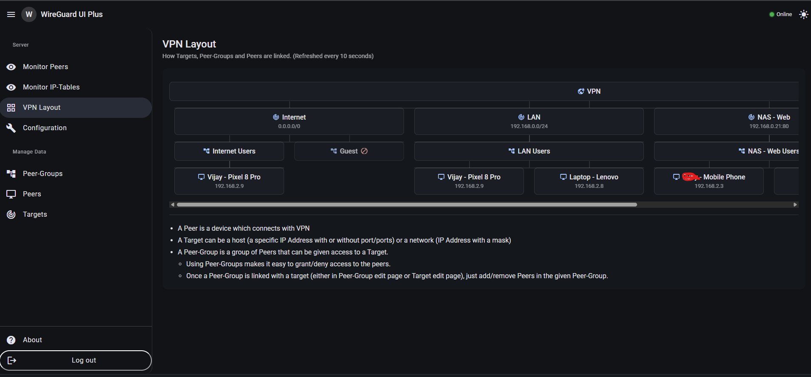

# WireGuard UI Plus

WireGuard UI Plus is a Dockerized web UI for running and managing a WireGuard
VPN. The Angular single-page application and Django REST API run together in one
container, which also generates WireGuard configuration and related iptables
rules.

> **Disclaimer:** Use this software at your own risk. It was developed for
> personal use at home and is shared in the hope that it is useful to others.

## Overview



## Why this project?

WireGuard UI Plus is designed for home and small-network VPNs where different
clients need different access. Instead of maintaining fine-grained iptables
rules by hand, define resources as targets, put clients into peer groups, and
associate targets with those groups.

## Key features

- Manage WireGuard clients (**peers**), peer groups, and resource **targets**.
- Grant or revoke access through peer-group/target relationships.
- Generate peer configurations, QR codes, `.conf` downloads, and optional e-mail.
- Configure full-tunnel or narrower relationship-based `AllowedIPs` behavior.
- Apply generated WireGuard configuration and monitor peer status and iptables.
- Visualize relationships in **VPN Layout**.
- Responsive dark/light Angular UI and support for Raspberry Pi and other
  single-board computers.
- Optional Streamable HTTP MCP server support, disabled by default.

## Quick start

You need Docker and a host that can grant the container `NET_ADMIN` and
`SYS_MODULE`, set the required IPv4 sysctls, and access host kernel modules.

1. Create the persistent directories:

   ```bash
   mkdir -p ./config ./data
   ```

   Ensure that these directories are writable by the container runtime user.

2. Start the image (this example publishes host UDP `1196` to the default
   container WireGuard UDP port `51820` and the UI on TCP `8000`):

   ```bash
   docker run -it --rm \
     --cap-add NET_ADMIN --cap-add SYS_MODULE \
     --sysctl net.ipv4.conf.all.src_valid_mark=1 \
     --sysctl net.ipv4.ip_forward=1 \
     -v "${PWD}/data":/data -v "${PWD}/config":/config \
     -v /lib/modules:/lib/modules:ro \
     --tmpfs /tmp:rw,nosuid,nodev,noexec \
     -p "1196:51820/udp" -p "8000:8000" \
     ghcr.io/vijaygill/wg-ui-plus:latest
   ```

3. Forward the selected UDP port from the router to the WireGuard host and open
   `http://<internal-host-ip>:8000`.
4. Log in with `admin` / `admin` and immediately change the password in
   **Server Configuration** → **Change Password**.
5. Set **Host Name External** and **Upstream DNS Server**, review **Local
   Networks**, then select **Apply Changes**.
6. Open a peer, scan its QR code with the WireGuard client, and configure access
   using [ACCESS_CONTROL.md](./ACCESS_CONTROL.md).

The container-local `/tmp` tmpfs provides temporary working space without
exposing the host's `/tmp` to the container. It is intentionally non-persistent
and uses `nosuid`, `nodev`, and `noexec`; do not replace it with a host `/tmp`
bind mount unless a specific local development integration requires that broader
host access.

For persistent Compose deployment, start with
[docker-compose-example.yml](./docker-compose-example.yml) and read
[DEPLOYMENT.md](./DEPLOYMENT.md) first. The example maps host UDP `1195` to
the default container UDP `51820` but does not set `WG_PORT_EXTERNAL` (default
`1196`). Add `WG_PORT_EXTERNAL=1195` or change the mapping so peer
configurations, router forwarding, and the application agree. The example also
enables `CORS_ALLOW_ALL_ORIGINS=true` for convenience; restrict it before
deployment.

## How Traffic Flows Through WireGuard UI Plus

The following diagram uses **sample/example values only** to show how a peer
reaches a target through WireGuard UI Plus. The peer and target names, host
names, IP addresses, and ports are illustrative and must be replaced with the
values from your network.

```text
  External / public side (sample values)

  Alice's Laptop (sample peer)
  VPN address: 10.8.0.2 (sample)
          │
          │  Encrypted WireGuard tunnel to the sample router endpoint
          │  Endpoint: 203.0.113.10:1196/UDP (sample)
          ▼
  ┌──────────────────────────────────────────────────────────────┐
  │ Your ISP's Router/Modem                                      │
  │ WAN/external IP: 203.0.113.10 (documentation-only sample)    │
  │ External WireGuard port: UDP 1196 (sample)                   │
  │                                                              │
  │ Port forwarding: 203.0.113.10:1196/UDP                       │
  │                  ───────────────► 192.168.1.10:51820/UDP     │
  └──────────────────────────────────────────────────────────────┘
          │
          │  Internal LAN (sample)
          ▼
  ┌──────────────────────────────────────────────────────────────┐
  │ WireGuard UI Plus machine (sample host)                      │
  │ Internal IP: 192.168.1.10 (sample)                           │
  │ Internal WireGuard port: UDP 51820 (default; sample)         │
  │ Web UI: TCP 8000 (sample)                                    │
  │ VPN address: 10.8.0.1 (sample)                               │
  └──────────────────────────────────────────────────────────────┘
          │
          │  Allowed traffic for Alice's sample peer
          ▼
  ┌──────────────────────────────────────────────────────────────┐
  │ Sample target: NAS                                           │
  │ Internal address: 192.168.1.50 (sample)                      │
  │ Allowed target ports: TCP 139 and TCP 445 (sample)           │
  └──────────────────────────────────────────────────────────────┘
```

`203.0.113.10` is reserved for documentation examples and is not a real
address to configure. Your router's actual public IP or DNS name, external
WireGuard port, internal host IP, VPN addresses, and target address depend on
your network. The **external port** (`UDP 1196` in this example) is the
router-facing port used by peer endpoints and forwarded by the router. The
**internal WireGuard port** (`UDP 51820` by default) is the port where the
WireGuard UI Plus host receives the forwarded traffic. The NAS's **target
ports** (`TCP 139` and `TCP 445` in this example) are separate application
ports allowed after the VPN connection is established; they are not
WireGuard listener ports.

## Documentation

- [FAQ](./FAQ.md) — answers about installation, configuration, access, routing,
  troubleshooting, authentication, MCP, e-mail, updates, backups, and security.
- [Access control](./ACCESS_CONTROL.md) — peers, peer groups, targets,
  relationships, examples, `AllowedIPs`, and applying changes.
- [Deployment](./DEPLOYMENT.md) — Docker/Compose, ports, volumes, privileges,
  environment settings, backups, upgrades, and secure exposure.
- [Development](./DEVELOPMENT.md) — development shell, Angular/backend builds,
  tests, and contributor commands.
- [MCP server](./MCP.md) — MCP administration, authentication, tools, and
  transport details.

Issues and pull requests are welcome. See [DEVELOPMENT.md](./DEVELOPMENT.md)
before working on the project.
