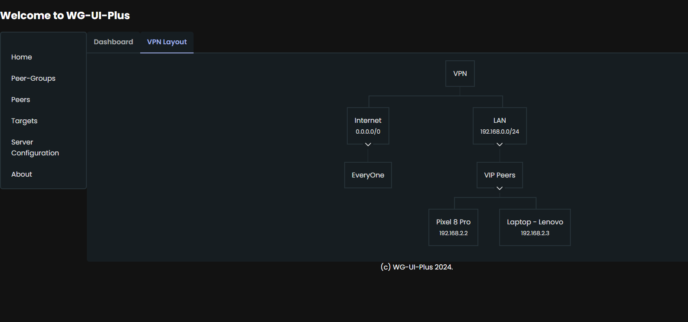

# WireGuard UI Plus

A Dockerised UI to run and manage a WireGuard VPN in the same container.

## Disclaimer
Usage of this software is purely at your own risk. I am just sharing what I developed for myself and use at home.

## Background
I was just exploring the combination of Django REST Framework + Angular. So I thought I might as well develop something for myself to replace my current WireGuard based VPN where I was managing the IPTables rules by hand (for the post-up script used by WireGuard). So far, I like this combo and though this is WIP, I have already replaced my lscr.io/linuxserver/wireguard based setup with this project.

This is going to grow more in coming times. So keep an eye on this project. Use it and raise issues and/or PR's to make it better.

## Features
* Easy management of clients (a.k.a Peers).
  * Clients (Peers) are managed in groups for easy granting/revoking of access.
* Allows access to various resources (a.k.a Targets - a target can be a host or a network)
  * Allows scenarios like
    * Some users can access internet but nothing else.
    * Some users can access only SSH on a host and nothing else.
    * Some users can access only samba shares on NAS.
    * Some users can access internet and every machine in the LAN.
    * Some users can access only the LAN.
* Hides complexity of managing IPTables rules.
* Uses WireGuard (tm).
  * Benchmarks show that WireGuard (tm) is multiple times faster than OpenVPN (tm).
* Web based UI can be accessed from anywhere.
* Distributed as docker image. So updates are very easy to perform. 
* Runs on Raspberry Pi. Developed on OrangePi-5+. Thus proven to run at-least on those SBC's.

## Requirements
You need to have docker setup and running on your machine where the VPN needs to be run.

## Setup
#### Note: Default username/password is admin/admin. You can change it later in "Server Configuration page".
You can set up your own VPN in a few minutes by following the following steps:
1. Gather the following information
   * IP address assigned to your router (refered to as External IP address in this document )
   * IP address of the machine / raspberry pi / any other SBC you are going to use to run the VPN (refered to as Internal IP address in this document ).
2. Using the port forwarding feature of your router, forward the port 1196 to the port 51820 and use internal IP address as the target machine.
3. Now start the WireGuard UI Plus using the following command
   ```
   mkdir -p ./config ./data && chmod og+w config data && docker run -it --rm  --cap-add NET_ADMIN --cap-add SYS_MODULE --sysctl net.ipv4.conf.all.src_valid_mark=1 --sysctl net.ipv4.ip_forward=1 -v "${PWD}/data":/data -v "${PWD}/config":/config -v /lib/modules:/lib/modules:ro -v /tmp:/tmp -p "1196:51820/udp" -p "8000:8000" ghcr.io/vijaygill/wg-ui-plus:dev
   ```
4. Point your browser to the address "http://internal_ip_address:8000".
5. In the server configuration page
   * In the server configuration page, use the external ip address for the value for the field "Host Name External". For long term setup, have a domain name set up pointing to your IP address (I use duckdns).
   

   * Change the upstream DNS server to suitable value. I have pihole on 192.168.0.5 in my setup. you can use 8.8.8.8 also.
   * Click on "Ok" to save data.
   * A message will pop up at the top of the page to tell you that the changes need to be applied and VPN restarted.
     Click on "Apply Changes" button.
     

6. In Peers management page, click on "Edit" button for any of the peers created by default.
   * Scan QR code in next step
     

7. Install WireGuard app on your mobile phone and add tunnel by scanning the QR code.
8. You should be able to access internet on your mobile phone via the VPN.

Now you can start adding more targets and peer-groups and peers to configure the VPN in any way you need.

Note: Every Peer is member of "EveryOne" Peer-Group. In this setup, I enabled the target "Internet" for "Everyone", hence my mobile phone can access the internet also via the VPN. This could be stopped by removing the Target from EveryOne peer-group in Peer-Group edit page.

From here, you can go on the make this setup as advanced as you want. Use "docker compose", or put it behind nginx reverse proxy, add SSL and so on.

## Further usage (configuration)
Now you can start expanding your setup. But first let's get a few terms cleared in following text.
* Target: A target is a resource your users can access. It can be
  * a host (just IP address in the format A.B.C.D)
  * a host with ports (IP address with the format A.B.C.D:N1,N2,N3... where N1, N2, N3 and so on are port numbers)
  * a network address (a network address and a mask)
* Peer: A client - any device that accesses the targets via the VPN.
* Peer-Group - just a logical group of peers which allowed/denied access to a target. Peers-Groups were implemented to help easy management of access for Peers.

Always remember: Targets are resources. Peers-groups are logical groups of Peers (clients) and are added/removed from targets (to grant/deny access). Peers are clients are added / removed from Peer-Groups (to grant/deny access).

Now let's take an example of your NAS which has Samba server running (port 139 and port 445 are used) on say host 192.168.0.51. The IP addresses used in example are, well, just examples. You wll need to replace those with real IP addresses.

1. Login into the WireGuard UI Plus app.
2. Go to Peer-Groups page (by clicking on "Peer-Groups" link under "Manage Data" section)
    1. In the resulting page, enter following data
        1. Name (say NAS Shares Users)
        2. Description (enter any description here)
        3. Click on save "Ok" button.
        
3. Go to Peers page (by clicking on "Peer" link under "Manage Data" section)
    1. In the resulting page, enter following data
        1. Name (say Test NAS User)
        2. Description (enter any description here)
        3. Drag the Peer-Group "NAS Shares Users" from "Available" list to "Selected" list.
        4. Click on save "Ok" button.
        
4. Go to page "Targets" under "Manage Data" section.
    1. Click on new button
    2. In the resulting page, enter following data
        1. Name (say NAS Shares)
        2. Description (enter any description here)
        3. In the IP Address field, enter "192.168.0.51:139,445" (without the quotes)
        4. Drag the Peer-Group "NAS Shares Users" from "Available" list to "Selected" list.
        5. Click on save "Ok" button.
        
5. Click on "VPN Layout" under "Server" section. You should see the layout as following.
        
6. Now click on "Apply Changes" button at the top.
7. Now you can add tunnel on your desired device by going to Peer page again and clicking on "Edit" button to show the QR code.
8. That's it. Your client should be able to access the samba shares on NAS.


## Features
Functionality implemented/yet to be implemented so far (getting ready for first release)
- [x] Manage targets - Add/Edit/Disable.
  - [x] Add/Remove Peer-Groups to/from Target thus allowing/denying access.
- [x] Manage Peers - Add/Edit/Disable.
  - [x] Add/Remove Peers from Peer-Groups, thus allowing/denying access to the targets a Peer-Group is associated with.
- [x] Manage Peer-Groups - Add/Edit/Disable
  - [x] Add/Remove Targets to/from Peer-Groups, thus allowing/denying access.
- [x] Live Dashboard
  - [x] Show current status of Peers.
  - [x] Show IPTables rules along with the counters for various chains.
- [x] Authentication
- [x] Configuration of Client Peer
  - [x] Display QR-code for scanning using camera on the client device.
  - [x] Download and share ".conf" file with the client device.
  - [ ] Ability to send configuration files for peers by email by single click.

## Screenshots with some features shown
* Dashboard showing currently connected peers
  
* Setup at my home where I added a Peer-Group "VIP Users" who can access LAN (192.168.0.0/24) and added two Peers to that group. Internet can be accessed by "Everyone" group (by default, but can be changed).
  
* Monitor IPTables
  


## Development guide

This repository comes with a Docker based development environment, for more details, see [devenv.md](devenv.md). Needs some work to make it useful.
